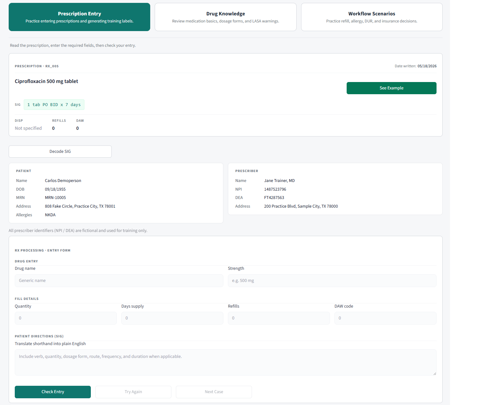

# Rx Entry Simulator

A Streamlit simulator that helps pharmacy technician students practice prescription entry, label interpretation, and common pharmacy workflow scenarios.

## Live Demo

https://donnyphi-rx-lab.streamlit.app/

## Screenshot

## Why I Built This

Built for my pharm-tech cohort ahead of the June certification exam.

## Features

- Prescription-entry practice
- Pharmacy-label interpretation
- Simulated pharmacy workflow questions
- Instant feedback for practice attempts
- Clean Streamlit interface for fast review
- Designed for pharmacy technician certification preparation

## Tech Stack

- Python
- Streamlit
- Pandas
- GitHub
- Streamlit Community Cloud

## Author

Donny Nguyen
